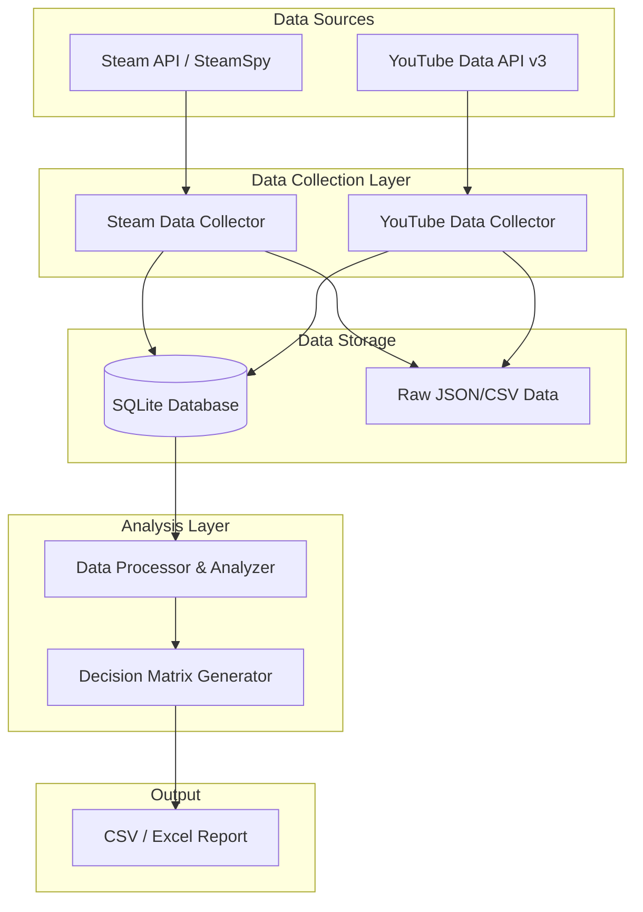

# Steam Survival Crafting Trend Pipeline: 프로젝트 구조 및 구현 명세서

본 문서는 스팀 얼리 액세스 '서바이벌 크래프팅' 장르 게임들의 실시간 CCU와 유튜브 트렌드 데이터를 수집하여 의사결정 매트릭스를 도출하는 데이터 파이프라인의 전체 구조와 상세 요구사항을 정의합니다.

---

## 1. 프로젝트 전체 구조 설계 (System Architecture)

### 1.1 시스템 구성도


### 1.2 디렉토리 구조
```text
game_trend/
│
├── data/                  # 수집된 데이터 저장소
│   ├── raw/               # 원본 JSON/CSV 파일
│   └── processed/         # 정제된 데이터 파일
│
├── database/              # SQLite DB 파일
│   └── game_trend.db
│
├── src/                   # 파이썬 소스 코드
│   ├── config.py          # API 키 및 설정 변수 관리
│   ├── steam_collector.py # 스팀 데이터 수집 모듈
│   ├── yt_collector.py    # 유튜브 데이터 수집 모듈
│   ├── processor.py       # 데이터 병합 및 매트릭스 계산 모듈
│   └── main.py            # 파이프라인 실행 엔트리포인트
│
├── requirements.txt       # 의존성 패키지 목록
└── README.md              # 프로젝트 설명서
```

---

## 2. 상세 기능 구현 명세서 (로컬 AI 프롬프트용)

> **[안내]** 아래의 `[프롬프트 시작]` 부터 `[프롬프트 끝]` 까지의 텍스트를 복사하여 로컬 LM Studio(Gemma-4-e4b)에 입력하세요.

### [프롬프트 시작]

당신은 데이터 엔지니어이자 파이썬(Python) 개발자입니다. 다음 요구사항(Requirements)을 읽고, 스팀 서바이벌 크래프팅 장르의 트렌드를 분석하기 위한 데이터 수집 및 분석 파이프라인 파이썬 코드를 작성해주세요.

**[프로젝트 개요]**
- 목표: 스팀 얼리 액세스 '서바이벌 크래프팅' 게임의 실시간 CCU와 유튜브 트렌드 데이터를 수집하여 의사결정 매트릭스(CSV/Excel)를 도출합니다.
- 언어: Python 3.10+
- 주요 라이브러리: `requests`, `pandas`, `sqlite3`, `python-dotenv`, `google-api-python-client`

**[상세 요구사항]**

**1. 설정 및 환경 변수 (`src/config.py`)**
- `.env` 파일에서 `STEAM_API_KEY`와 `YOUTUBE_API_KEY`를 로드합니다.
- 타겟 장르/태그(예: "Survival", "Crafting", "Early Access")를 상수로 정의합니다.
- 데이터베이스 경로(`database/game_trend.db`)를 설정합니다.

**2. 스팀 데이터 수집 (`src/steam_collector.py`)**
- SteamSpy API 또는 Steam Web API를 사용하여 다음 조건에 맞는 게임 리스트를 가져옵니다.
  - 조건: 'Survival' 및 'Crafting' 태그 포함, 'Early Access' 상태인 게임 (최소 10~20개 타겟팅)
- 수집할 데이터 포인트:
  - `AppID`, `Game Name`, `Current CCU` (실시간 동시접속자), `Peak CCU`, `Price`, `Positive Reviews`, `Negative Reviews`
- 데이터를 반환하고, 필요한 경우 SQLite DB의 `steam_data` 테이블에 저장/업데이트합니다.

**3. 유튜브 트렌드 수집 (`src/yt_collector.py`)**
- YouTube Data API v3를 사용하여 위에서 수집한 `Game Name`을 검색어로 비디오 데이터를 수집합니다.
- 수집 조건: 지난 30일 이내 업로드된 영상.
- 수집할 데이터 포인트:
  - 검색된 상위 10개 영상의 `Total Views`, `Total Likes`, `Total Comments` 합계 및 평균치 계산.
- 계산된 트렌드 수치를 SQLite DB의 `youtube_data` 테이블에 저장합니다.

**4. 데이터 프로세싱 및 의사결정 매트릭스 도출 (`src/processor.py`)**
- `pandas`를 사용하여 `steam_data`와 `youtube_data`를 `AppID` 또는 `Game Name`을 기준으로 병합(Merge)합니다.
- **파생 변수 계산**:
  - `Review Score`: (Positive Reviews / Total Reviews) * 100
  - `Hype Ratio` (기대감 지수): (Total YouTube Views) / (Current CCU + 1) -> CCU 대비 유튜브 반응이 높은 게임 찾기
  - `Engagement Score`: YouTube (Likes + Comments) 합계
- **의사결정 매트릭스 (Decision Matrix) 생성**:
  - `Tier S`: CCU 높음(상위 20%) & Hype Ratio 높음
  - `Tier A`: CCU 중간 & Hype Ratio 매우 높음
  - `Tier B`: 기타
- 결과를 `data/processed/decision_matrix_YYYYMMDD.csv` 형태로 저장합니다.

**5. 메인 실행 파일 (`src/main.py`)**
- 위 모듈들을 순차적으로 실행하는 파이프라인 구조를 만듭니다.
- 에러 핸들링(`try-except`)을 적용하고 각 단계별 성공/실패 여부를 `print` 또는 `logging`으로 출력합니다.

위의 명세를 바탕으로, `requirements.txt`에 필요한 패키지 목록을 작성해주고, 디렉토리 구조에 맞춰 각 파이썬 파일의 코드를 완벽하게 작성해 주세요. 코드는 모듈화되어 있어야 하며, 함수와 클래스에 적절한 Docstring을 포함해야 합니다.

### [프롬프트 끝]
